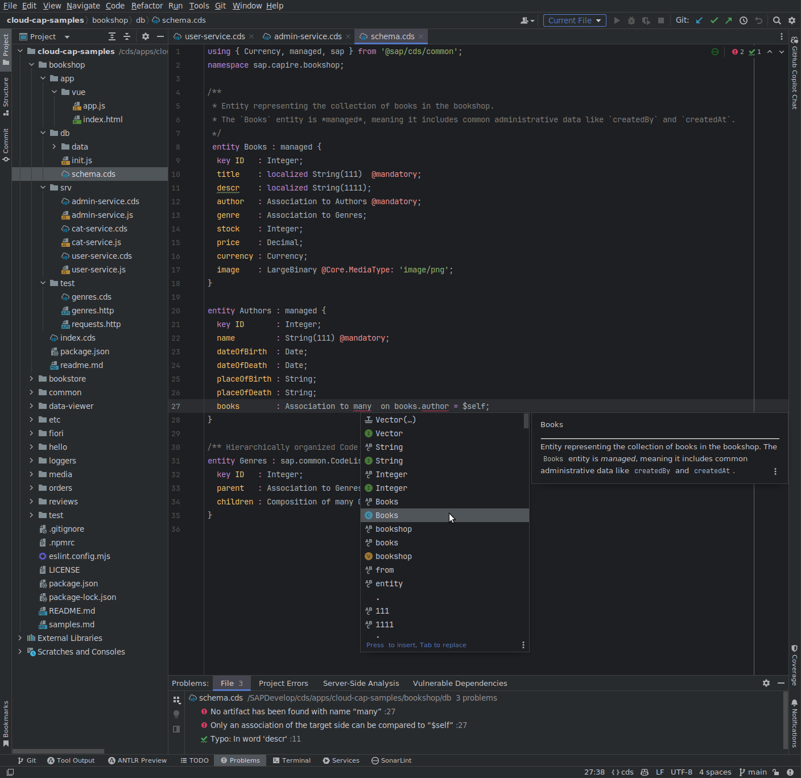
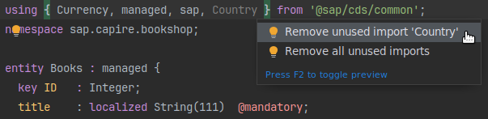
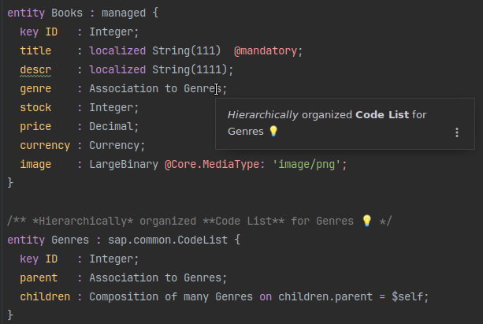
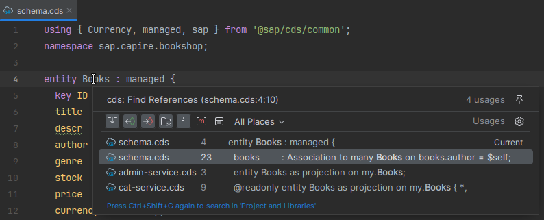
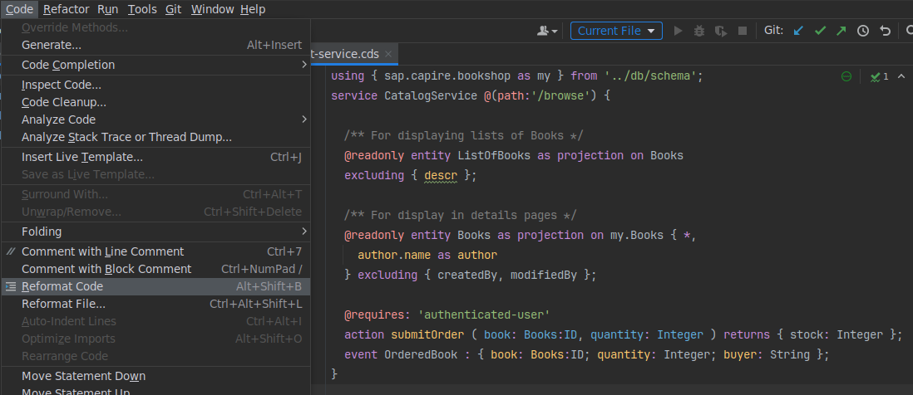
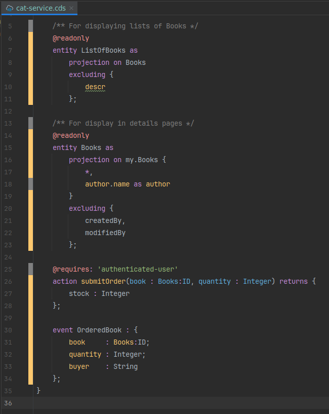
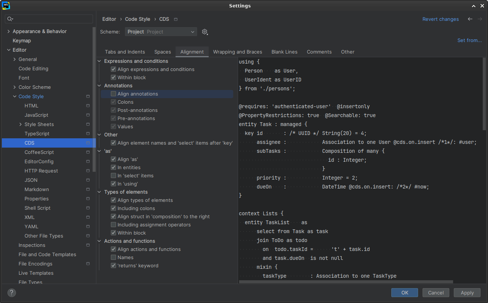

## Features

The [IntelliJ LSP API](https://plugins.jetbrains.com/docs/intellij/language-server-protocol.html#supported-features)
already enables a set of useful language features:

| Feature                  | API Support | Server Support | LSP Request                     | Remarks                                                                                        |
|--------------------------|:-----------:|:--------------:|---------------------------------|------------------------------------------------------------------------------------------------|
| Syntax Highlighting      |      ✔✔     |       ✔        | (local, based on TextMate)      | TM Bundle is automatically registered on plugin installation (and disabled on uninstallation). |
| Code Completion          |      ✔✔     |       ✔        | textDocument/completion         | Completing with global identifiers supported with completionItem/resolve (2024.2)              |
| Goto Definition          |      ✔✔     |       ✔        | textDocument/definition         |                                                                                                |
| Hover Documentation      |      ✔✔     |       ✔        | textDocument/hover              |                                                                                                |
| Document Formatting      |      ✔✔     |       ✔        | textDocument/formatting         |                                                                                                |
| Diagnostics              |      ✔✔     |       ✔        | textDocument/publishDiagnostics | Problems (errors, warnings).                                                                   |
| Quick Fixes              |      ✔✔     |       ✔        | textDocument/codeAction         |                                                                                                |
  - Translation support option
| Intention Actions        |      ✔      |       –        | textDocument/codeAction         | E.g. Refactoring or Organize Imports. No server support yet.                                   |
| Find References          |      ✔✔     |       ✔        | textDocument/references         |                                                                                                |
| Semantic Tokens          |      ✔      |       ✔        | textDocument/semanticTokens     | Improved highlighting: server dynamically assigns token semantics.                             |
| Document Highlights etc. |      –✔     |       ✔        | (various)                       | Requested by us, ETA unclear.                                                                  |
| DocumentLinks            |      –✔     |       ✔        |                                 |                                                                                                |
| AnalyzeDependencies      |      –-     |       ✔        |                                 |                                                                                                |
| Commands                 |      –-     |       ✔        |                                 |                                                                                                |
| - Restart LSP            |      –(✔)   |                | via short cut                   |                                                                                                |
| CodeLens                 |      -✔     |       ✔        |                                 |                                                                                                |
| Outline                  |      ?✔     |       ✔        | textDocument/symbols            | both flat and hierarchical                                                         |
Workspace Symbols: managed (common.cds) not shown
.cdsprettier.json schema registration to support code completion in text editor

  - Maintain translation quickfix works in principal, but properties file is not saved and thus LSP won't get updated and still suggest quickfix

User options
Change serverId to cap-cds-language-server

### Examples

#### Syntax Highlighting, Code Completion, Diagnostics

#### Quick Fix

#### Hover Documentation

#### Find References

#### Document Formatting: before…

#### … and after

#### Adjust the Code Style

### Upcoming

Depending on the IntelliJ platform development roadmap, we expect to see more features available in the near future.
These will enable *SAP CDS Language Support for IntelliJ* to provide:

- Code structure
- Highlighting of occurrences in same file
- Navigation via import path or symbol name
- Type generation with [CDS Typer](https://cap.cloud.sap/docs/tools/cds-typer) on save
- and more…
