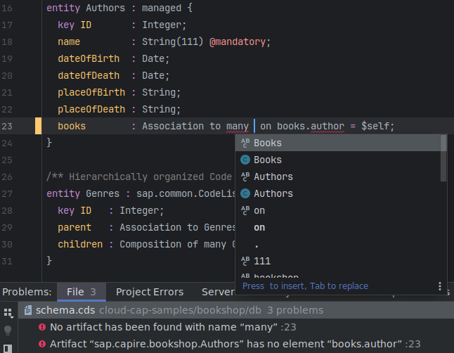

## Features

The [IntelliJ LSP API](https://plugins.jetbrains.com/docs/intellij/language-server-protocol.html#supported-features) already enables a set of useful language features:

| Feature                  | API Support  | Server Support | LSP Request                     | Remarks                                                                                        |
|--------------------------|:------------:|:--------------:|---------------------------------|------------------------------------------------------------------------------------------------|
| Syntax Highlighting      |      ✔       |       ✔        | (local, based on TextMate)      | TM Bundle is automatically registered on plugin installation (and disabled on uninstallation). |
| Code Completion          |      ✔       |       ✔        | textDocument/completion         |                                                                                                |
| Goto Definition          |      ✔       |       ✔        | textDocument/definition         |                                                                                                |
| Diagnostics              |      ✔       |       ✔        | textDocument/publishDiagnostics | Problems (errors, warnings).                                                                   |
| Hover Documentation      |      ✔       |       ✔        | textDocument/hover              |                                                                                                |
| Document Formatting      |      ✔       |       ✔        | textDocument/formatting         |                                                                                                |
| Quick Fixes              |     (✔)      |       ✔        | textDocument/codeAction         | Related to a Problem. Incomplete API support, may come with IJ 2024.1                          |
| Intention Actions        |      ✔       |       –        | textDocument/codeAction         | E.g. Refactoring or Organize Imports. No server support yet.                                   |
| Find References          |   2024.1 ⏳   |       ✔        | textDocument/references         |                                                                                                |
| Semantic Tokens          |   2024.1 ⏳   |       ✔        | textDocument/semanticTokens     | Improved highlighting: server dynamically assigns token semantics.                             |
| Document Highlights etc. | \>= 2024.1 ⏳ |       ✔        | (various)                       | Requested by us, ETA unclear.                                                                  |

### Upcoming

We have requested support for various additional LSP requests (functionality already available in server).
These will enable *intellij-cds* to provide:
- Code structure
- Highlighting of occurrences in same file
- Navigation via import path or symbol name
- Type generation with [CDS Typer](https://cap.cloud.sap/docs/tools/cds-typer) on save
- and more…
