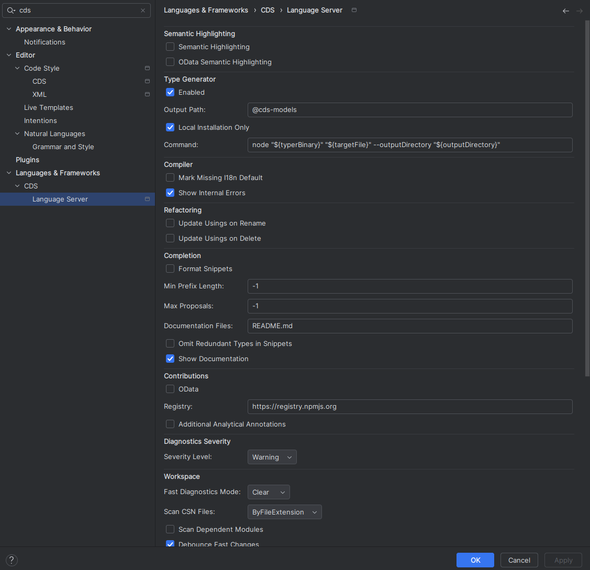

## Features

CDS Language Support for IntelliJ offers the following features based on the LSP4IJ plugin:

| Feature              | LSP4IJ Support | API Support | Server Support | LSP Request                                         | Remarks                                                                                        | Tested Working                                           |
|----------------------|----------------|:-----------:|:--------------:|-----------------------------------------------------|------------------------------------------------------------------------------------------------|----------------------------------------------------------|
| Syntax Highlighting  | ✔              |      ✔      |       ✔        | (local, based on TextMate)                          | TM Bundle is automatically registered on plugin installation (and disabled on uninstallation). | ✓                                                        |
| Code Completion      | ✔              |      ✔      |       ✔        | textDocument/completion                             | Completing with global identifiers supported with completionItem/resolve (2024.2)              | ✓                                                        |
| Goto Definition      | ✔              |      ✔      |       ✔        | textDocument/definition                             |                                                                                                | ✓ *Go declaration or usages*, ❌ *Go to type declaration* |
| Goto Declaration     | ✔              |      –      |       ✔        | textDocument/declaration                            |                                                                                                | ? (see above; how to trigger?)                           |
| Goto Implementation  | ✔              |      –      |       ✔        | textDocument/implementation                         |                                                                                                | ? (see above; how to trigger?)                           |
| Goto Type Definition | ✔              |      –      |       ✔        | textDocument/typeDefinition                         |                                                                                                | ? (see above; how to trigger?)                           |
| Hover Documentation  | ✔              |      ✔      |       ✔        | textDocument/hover                                  |                                                                                                | ✓                                                        |
| Signature Help       | ✔              |      –      |       ✔        | textDocument/signatureHelp                          | Parameter hints and documentation                                                              | ? (how to trigger?)                                      |
| Document Formatting  | ✔              |      ✔      |       ✔        | textDocument/formatting                             |                                                                                                | ✓                                                        |
| Range Formatting     | ✔              |      –      |       ✔        | textDocument/rangeFormatting                        | Format selected text ranges                                                                    | ✓                                                        |
| Diagnostics          | ✔              |      ✔      |       ✔        | textDocument/publishDiagnostics                     | Problems (errors, warnings).                                                                   | ✓                                                        |
| Quick Fixes          | ✔              |      ✔      |       ✔        | textDocument/codeAction                             |                                                                                                | ✓                                                        |
| Intention Actions    | ✔              |      ✔      |       –        | textDocument/codeAction                             | E.g. Refactoring or Organize Imports. No server support yet.                                   | n/a                                                      |
| Find References      | ✔              |      ✔      |       ✔        | textDocument/references                             |                                                                                                | ✓                                                        |
| Rename Symbol        | ✔              |      –      |       ✔        | textDocument/rename                                 | Symbol renaming with validation                                                                | ❌                                                        |
| Prepare Rename       | ✔              |      –      |       ✔        | textDocument/prepareRename                          | Validate rename operation before execution                                                     | ?                                                        |
| Selection Range      | ✔              |      –      |       ✔        | textDocument/selectionRange                         | Smart selection expansion                                                                      | ❌                                                        |
| Code Folding         | ✔              |      –      |       ✔        | textDocument/foldingRange                           | Collapsible code sections                                                                      | ❌                                                        |
| Call Hierarchy       | ✔              |      –      |       ✔        | textDocument/prepareCallHierarchy + callHierarchy/* | Navigate call relationships                                                                    | ? (sample source?)                                       |
| Type Hierarchy       | ✔              |      –      |       ✔        | textDocument/prepareTypeHierarchy + typeHierarchy/* | Navigate type relationships                                                                    | ?                                                        |
| Semantic Tokens      | ✔              |      ✔      |       ✔        | textDocument/semanticTokens                         | Improved highlighting: server dynamically assigns token semantics.                             | ?                                                        |
| Document Highlights  | ✔              |      –      |       ✔        | textDocument/documentHighlight                      |                                                                                                | ✓                                                        |
| DocumentLinks        | ✔              |      –      |       ✔        | textDocument/documentLink                           |                                                                                                | ✓                                                        |
| AnalyzeDependencies  | ✔              |      –      |       ✔        |                                                     |                                                                                                | ? (how to trigger?)                                      |
| Commands             | ✔              |      –      |       ✔        |                                                     |                                                                                                | (implicitly tested)                                      |
| CodeLens             | ✔              |      ?      |       ✔        | textDocument/codeLens                               |                                                                                                | ❌                                                        |
| Outline              | ✔              |      ?      |       ✔        | textDocument/documentSymbol                         | both flat and hierarchical                                                                     | ✓                                                        |
| Workspace Symbols    | ✔              |      –      |       ✔        | workspace/symbol                                    | Workspace-wide symbol search                                                                   | ❌ (not displayed)                                        |

Known issues/open points:

- Workspace Symbols: managed (common.cds) not shown in cap-cloud-samples repo
- `.cdsprettier.json` schema registration needed to support code completion in text editor
- Maintain translation quickfix works in principal, but properties file is not saved and thus LSP won't get updated and
  still suggest quickfix
- Change serverId to cap-cds-language-server

### Examples

#### Syntax Highlighting, Code Completion, Diagnostics

#### Quick Fix

#### Hover Documentation

#### Find References

#### Document Formatting: before…

#### … and after

#### Adjust the Code Style

Changes in the Settings UI will synchronized with `.cdsprettier.json` in the workspace.

#### Configure the CDS Language Server

Changes in the Settings UI will synchronized with `.cds-lsp/.settings.json` in the workspace.

### Upcoming

Depending on the LSP4IJ development roadmap, we expect to see more features available in the near future.
These will enable *SAP CDS Language Support for IntelliJ* to provide:

- Type generation with [CDS Typer](https://cap.cloud.sap/docs/tools/cds-typer) on save
- and more…
