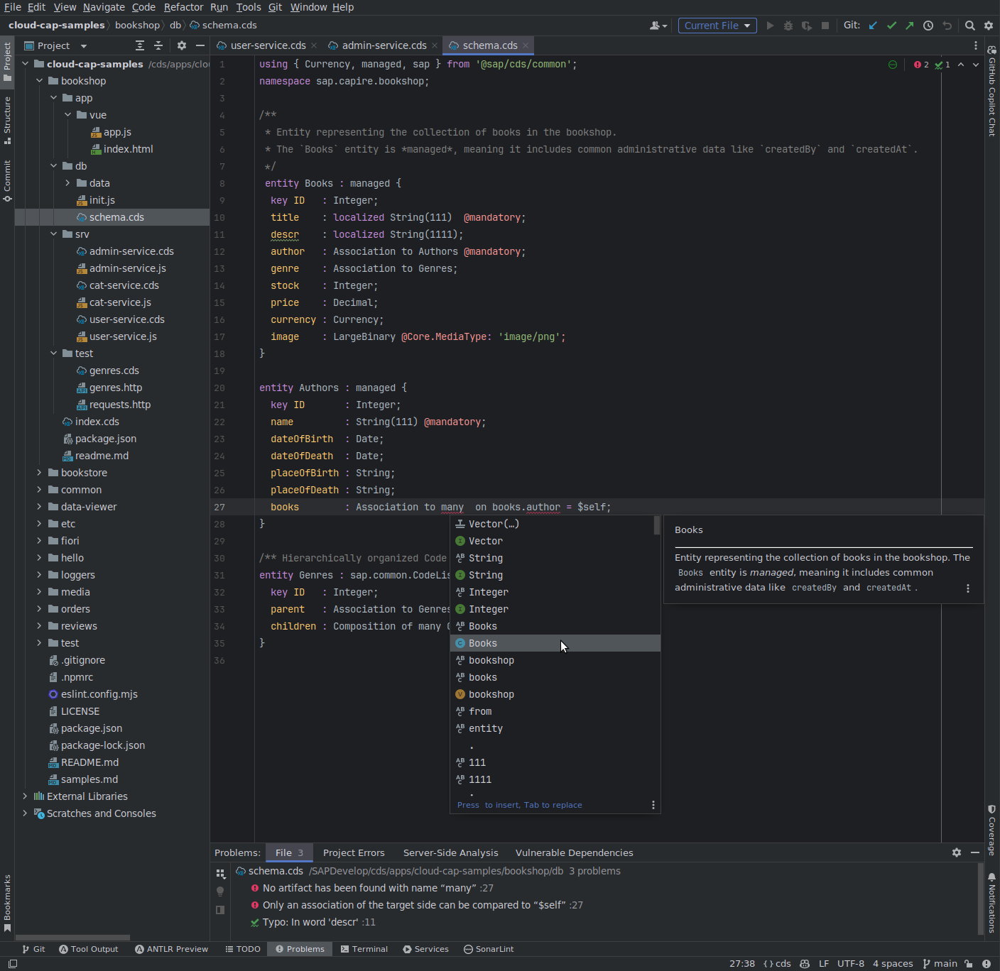

## Features

CDS Language Support for IntelliJ offers the following features based on the LSP4IJ plugin:

| Feature             | LSP4IJ Support | Server Support | LSP Request                      | Remarks                                                                                        | Tested Working                |
| ------------------- | -------------- | :------------: | -------------------------------- | ---------------------------------------------------------------------------------------------- | ----------------------------- |
| Syntax Highlighting | ✔              |       ✔        | (local, based on TextMate)       | TM Bundle is automatically registered on plugin installation (and disabled on uninstallation). | ✓                             |
| Code Completion     | ✔              |       ✔        | textDocument/completion          | Completing with global identifiers supported with completionItem/resolve                       | ✓ local, global identifiers   |
| Goto Definition     | ✔              |       ✔        | textDocument/definition          |                                                                                                | ✓ *Go declaration or usages*  |
| Goto Implementation | ✔              |       ✔        | textDocument/implementation      |                                                                                                | ✓                             |
| Hover Documentation | ✔              |       ✔        | textDocument/hover               |                                                                                                | ✓                             |
| Document Formatting | ✔              |       ✔        | textDocument/formatting          |                                                                                                | ✓                             |
| Range Formatting    | ✔              |       ✔        | textDocument/rangeFormatting     | Format selected text ranges                                                                    | ✓                             |
| Diagnostics         | ✔              |       ✔        | textDocument/publishDiagnostics  | Problems (errors, warnings).                                                                   | ✓                             |
| Quick Fixes         | ✔              |       ✔        | textDocument/codeAction          | Only for Diagnostics, no Intention Actions provided by server yet                              | ✓                             |
| Find References     | ✔              |       ✔        | textDocument/references          |                                                                                                | ✓                             |
| Selection Range     | ✔              |       ✔        | textDocument/selectionRange      | Smart selection expansion                                                                      | ❌                            |
| Semantic Tokens     | ✔              |      (✔)       | textDocument/semanticTokens/full | Server supports only textDocument/semanticTokens                                               | n/a                           |
| Document Highlights | ✔              |       ✔        | textDocument/documentHighlight   |                                                                                                | ✓                             |
| Document Links      | ✔              |       ✔        | textDocument/documentLink        |                                                                                                | ✓                             |
| AnalyzeDependencies | ✔              |       ✔        |                                  | Statistics for imported path                                                                   | ✓                             |
| Commands            | ✔              |       ✔        | workspace/executeCommand         |                                                                                                | ✓ (implicitly)                |
| Code Lens           | ✔              |      (✔)       | textDocument/codeLens            | Only used to display statistics                                                                | ✓                             |
| Outline             | ✔              |       ✔        | textDocument/documentSymbol      | both flat and hierarchical (IJ seems to only support hierarchical)                             | ✓ hierarchical                |
| Workspace Symbols   | ✔              |       ✔        | workspace/symbol                 | Workspace-wide symbol search                                                                   | ✓                             |

### Examples

#### Document Highlights, Hover Documentation, Outline

#### Syntax Highlighting, Code Completion, Diagnostics

#### Goto Definition

#### Goto Implementation

Navigate to the custom Node.js service implementation:

#### Quick Fix

#### Hover Documentation

#### Find References

#### Outline

#### Document Formatting

#### Adjust the Code Style

Changes in the Settings UI will be synchronized with `.cdsprettier.json` in the workspace.

> **Note on Code-Style Schemes:** The presence of a `.cdsprettier.json` file is designed to enforce consistent formatting for all developers working on a project. To achieve this, the plugin makes this file the single source of truth for all CDS-related code-style settings.
>
> When this file is present and its content changes, the plugin will automatically switch the project's code style to the **Project** scheme. This scheme is then populated exclusively from the settings defined in `.cdsprettier.json`, taking precedence over any other code-style settings. This behavior is intentional to guarantee that the project's defined formatting rules are always applied.

#### Configure the CDS Language Server

Changes in the Settings UI will synchronized with `.cds-lsp/.settings.json` in the workspace.

## Known Issues

- Maintain Translation quickfix works in principle, but properties file is not saved and thus LSP won't get updated and
  still suggests quickfix
- Range Formatting not correctly treating first line of selection
- Document Highlights not shown reliably
